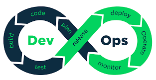
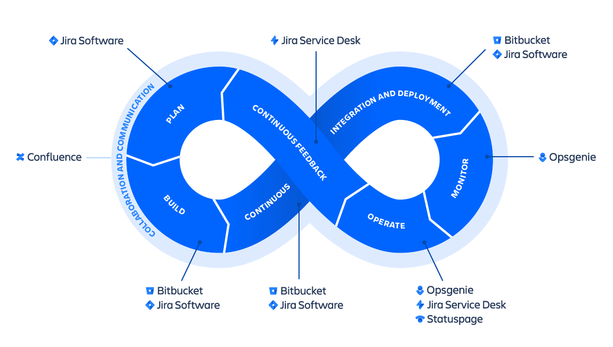
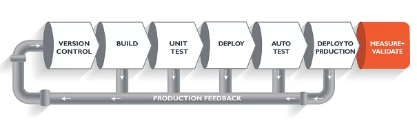
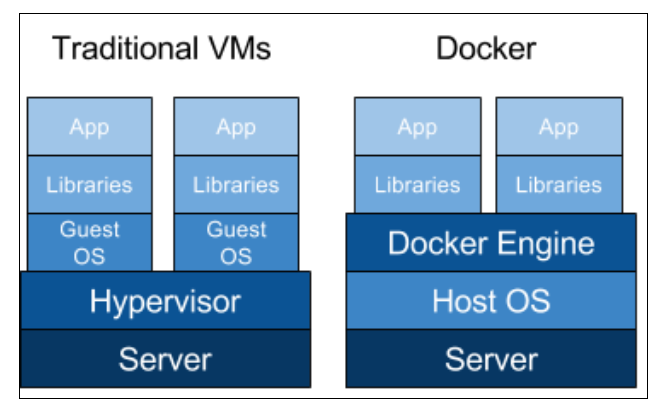
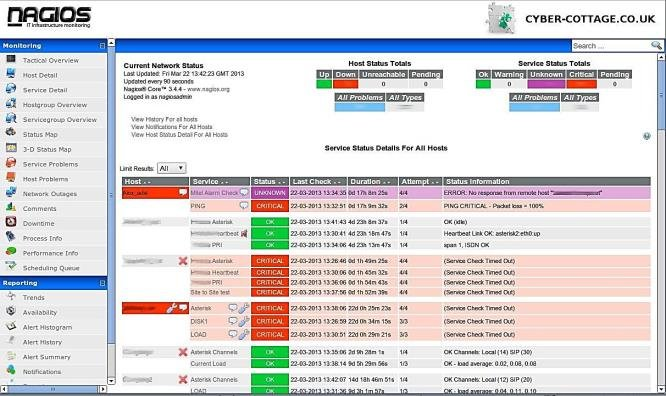

### 1. **Devops** merupakan singkatan dari dua kata yaitu *Development* dan *Operation*. Di mana kedua kata tersebut bermakna “operasional pengembang”. Seperti yang disebutkan sebelumnya, DevOps adalah sebuah prinsip developer untuk mengkoordinasikan antar tim yaitu tim development dengan tim operations dengan efektif dan efisien. 
 

### _Alur kerja_/_Kegiatan Devops_ 
 
* 1 **Continuous Integration**  
_Continuous Integration_ merupakan layanan yang diberikan DevOps untuk melakukan build dan automation testing. Kegiatan ini dikerjakan dengan menggunakan tools berupa Source Code Repository (SCR) untuk menemukan error code dan fixed code.  
* 2 **Continuous Delivery** 
_Continuous Delivery_ selalu bekerja di dalam software development untuk merubah kode. Proses ini dilakukan setelah Continuous Integration untuk menambah update lebih banyak untuk aplikasi yang sedang berjalan.  
* 3 **Continuous Deployment** 
Setelah proses _Continuous Integration-Delivery_ sudah dinyatakan dengan baik, tim development dapat melihat perubahan yang terjadi pada _environment test / environment development / environment production_.  
* 4 **Configuration Management** 
Proses ini berkaitan dengan *system engineering* yang bertujuan untuk _maintain_ konfigurasi sebuah produk. _Configuration Management_ memungkinkan otomatisasi dan standardisasi konfigurasi produk.  
* 5 **Infrastructure as a Code (IAAC)** 
IAAC adalah pekerjaan yang mana infrastruktur suatu produk didefinisikan melalui kode yang dapat diprogram, distandarisasi, dan mudah dalam duplikasi. Melalui IAAC, tim _development_ dapat menambah mesin melalui satu baris kode.  
* 6 **Monitoring** 
Produk IT menjadi sangat baik karena adanya proses _monitoring_ saat produk tersebut digunakan oleh pengguna. Tujuannya adalah untuk mengetahui bagaimana perubahan yang ada pada kode cukup berdampak pada produk dan penggunanya.  
* 7 **Logging** 
_Centralized logging_ menjadi hal yang tidak dapat dipisahkan dari kegiatan DevOps. Dengan menerapkan log aplikasi, kita developer bisa mengetahui produk yang dibuat berjalan dengan baik atau tidak.  

<h3><b>Kesimpulan<b></h3>

DevOps adalah instrumen lingkungan kerja pada perusahaan IT yang sedang berkembang saat ini. Prinsip ini dibuat dan digunakan untuk mengatasi berbagai permasalahan yang ada perusahaan IT untuk mengatur alur source code dalam hal pengembangan dan operasional.

[Sumber: Apa itu Devops?](https://www.dicoding.com/blog/apa-itu-devops/) 

### 2. _CI/CD_ atau Continues Integration/Continues Deployment adalah “jembatan” antara tim operasional dan development dengan melakukan automasi pembangunan, testing, dan perilisan aplikasi. CI/CD juga berguna dalam membantu developer dan tester dalam melakukan rilis dan update aplikasi atau software dengan lebih cepat dan aman, terutama karena CI/CD dilakukan dalam ‘environment’ yang terstruktur.  
<h3>Tahapan dalam implmentasi CI/CD</h3>
 

1. Developer akan menulis code yang akan dieksekusi melalui __Version Control__ system (contohnya git, svn, dsb.)
2. Setelah itu, software tersebut akan memasuki tahap **Build**. Pada tahap ini, developer akan melanjutkan codenya, code tersebut akan dikembalikan ke __Version Control__ untuk pembaruan. Code baru dan yang mula ditulis akan digabungkan, dan akan di-compile menggunakan Compiler.
3. Setelah tahap __Build__ selesai, kamu akan memasuki tahap __Testing__. Pada tahap ini akan dilakukan berbagai jenis tes untuk menguji kelayakan dari software.
4. Setelah tahap __Testing__ selesai, akan dimulai tahap __Deploy__. Pada tahap Deploy, kamu akan menjalankan software ke staging server atau test server. Staging server atau test server berlaku sebagai simulasi dan kamu bisa melihat code atau software melalui simulator tersebut.
5. Jika tahap __Deploy__ berhasil, kamu akan berlanjut ke tahap **Auto Test**. Jika keseluruhan software yang dikembangkan sudah dapat berjalan baik, maka software kamu sudah dapat dijalankan ke produksi (__Deploy to Production__).
6. Dalam setiap tahap, jika ada error dan semacamnya, kamu bisa menghubungi tim developer untuk membenarkan software tersebut, ini disebut sebagai **Production Feedback**. Developer akan memperbarui versi melalui **Version Control**, dan setiap tahap di atas akan berulang kembali. Siklus tersebut akan berulang sebanyak mungkin hingga diperoleh code yang dapat dijalankan ke server produksi, di mana kita dapat mengukur dan memvalidasi code. (__Measure + Validate__).  
[Sumber: Implementasi CI/CD Pipeline dalam Development Program](https://www.jagoanhosting.com/blog/implementasi-ci-cd-pipeline/) 

### 3. __*Perbedaan antara VMware dengan Docker*__
 

### Virtual machine (VM) adalah sebuah emulasi dari sebuah sistem komputer. Secara sederhana, virtual machine membuat kita bisa membagi resource hardware dari satu hardware fisik menjadi beberapa sistem komputer. 

### **Keunggulan VM**
* Resource hardware yang eksklusif sehingga tidak terganggu jika ada apps yang lain tiba-tiba membutuhkan resource yang tinggi
* Memiliki management tools dan security tools yang sudah matang
* Secara umum memiliki tingkat keamanan sedikit lebih tinggi bila dibandingkan dengan container   

### _Docker/Container_ adalah sebuah virtualisasi OS yang dapat membungkus suatu aplikasi beserta dependency dan environment-nya. Setiap container ini memiliki process yang terisolir sehingga tidak mengganggu host OS ataupun container yang lain. Prinsip container ini mirip dengan kontainer yang ada di kapal kargo di mana kapal kargo tersebut diibaratkan sebagai sistem komputer. 

### **Keunggulan Container**
* Fleksibel dan scalable
* Mengurangi resource yang dibutuhkan dalam IT Management
* Waktu yang dibutuhkan untuk mengemas dan memasang app dalam container lebih cepat bila dibandingkan dengan VM  

### **VM VS Container**
#### Secara singkat, Perbedaan antara VM dan Docker dijabarkan dalam tabel berikut:  
| Virtual Machine | Contaianer |
| --------------- | ---------- |
| Berat           | Ringan     |
| Performa terbatas pada konfigurasi VM | Performa maksimum tergantung pada hardware fisik |
| Virtualisasi pada level hardware | virtualisasi pada level OS |
| Waktu start up dalam hitungan menit | Waktu start up dalam hitungan detik |
| Terisolasi penuh pada level hardware sehingga lebih aman | Terisolasi pada level proses |
|  

[Sumber: Container VS Virtual Machine](https://inixindojogja.co.id/container-vs-virtual-machine/) 

### 4. tools yang saya gunakan untuk monitoring server, ialah nagios. alasan saya menggunakan nagios, karena Nagios merupakan open source monitoring sistem komputer, jaringan pemantauan dan monitoring infrastruktur aplikasi perangkat lunak. Nagios menawarkan pemantauan dan layanan peringatan untuk server, switch, aplikasi, dan layanan. Ia mengingatkan pengguna bila ada sesuatu yang salah dan mengingatkan mereka untuk kedua kalinya ketika masalah telah diselesaikan.  
### Nagios awalnya dirancang untuk berjalan di Linux tetapi juga berjalan dengan baik pada varian Unix lainnya. Ini adalah perangkat lunak bebas berlisensi di bawah syarat-syarat Lisensi versi GNU General Public 2 yang diterbitkan oleh Free Software Foundation. 

